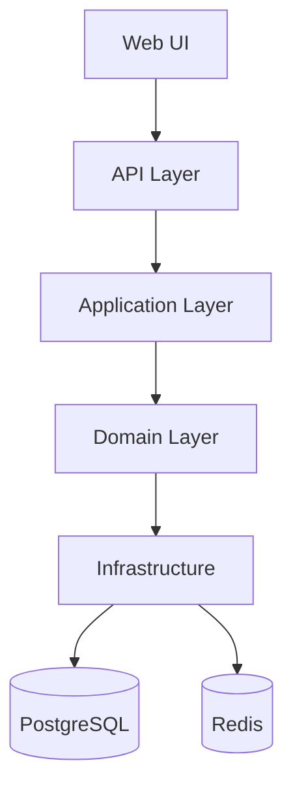

/**
 * @file: project.md
 * @description: Project overview, architecture, and standards.
 * @dependencies: docs/tasktracker.md, docs/diary.md, docs/qa.md
 * @created: 2026-01-26
 */

# Imlight Show Production

## Overview
Service for managing events, staff, contracts, and related workflows for show production.

## Goals
- Centralize data for events, staff, vendors, clients, and contracts.
- Provide operational visibility with calendars, reports, and audit trail.
- Reduce manual errors through validations and workflow statuses.
- Ensure security, performance, and maintainability.

## Users and Roles
- Admin: system configuration, access control.
- Project Manager: event lifecycle, schedules, resources.
- HR/Staff Manager: personnel records, availability, assignments.
- Accountant: payments, invoices, financial reports.
- Vendor/Contractor: limited access to assigned tasks and contracts.
- Client: read-only access to agreed documents and milestones.

## Core Modules
- Events: lifecycle, schedules, venues, budgets.
- Staff: profiles, availability, assignments.
- Contracts: templates, approvals, versions, signatures.
- Finance: invoices, payments, budgets, cost tracking.
- Assets: equipment, inventory, maintenance.
- Documents: storage, tagging, retention.
- Reports: KPIs, operational and financial summaries.

## Scope and Requirements

### Event Lifecycle
- Statuses: draft, request, in_work, completed, canceled.
- Required fields: title, date range, venue, client, budget, status.
- Versioned change history for key fields.
- Assignments: staff and assets linked to event.

### Staff Management
- Profiles with contacts, skills, certifications, rates.
- Availability calendar and conflict detection.
- Assignment tracking with role and time slots.
- Roles are configurable via reference data.

### Contracts
- Templates with custom additions and version control.
- Approval workflow with audit trail.
- Link contracts to events, clients, and vendors.
- Contract types are configurable via reference data.

### Finance
- Budget planning per event.
- Invoices and payments with status.
- Cost tracking by category and vendor.
- Currency: RUB.

### Documents and Assets
- Document tagging, categories, and retention policy.
- Asset inventory with serial numbers, status, and maintenance logs.

### Reporting
- Visual dashboard with sections:
  - Operations: event statuses, overdue tasks, resource load.
  - Finance: event profitability, invoices, payments, budget vs actual.
  - Staff: utilization, assignments, availability conflicts.
  - Contracts: approval pipeline, expiring contracts.

### Notifications
- Email notifications for status changes, assignments, approvals.
- Digest notifications for overdue tasks.

### Audit and Compliance
- Immutable audit log for critical actions.
- **Entity change history (implemented)**: who (actor_id), when (created_at), what (action, entity_type, entity_id); old and new values (old_values, new_values JSONB). Stored in PostgreSQL (`entity_change_history`, migrations 002, 004). **Retention: 1 year** — records older than 1 year are deleted automatically (on startup and every 24h). API: `GET /history`.
- Access review logs for sensitive data.

### Non-Functional Requirements
- RBAC with least-privilege access.
- P95 response under 300ms for standard queries.
- Daily backups and 30-day retention minimum.
- Availability target: 99.9% uptime.

## Scope
- Single-organization model.

## Data Import
- Import existing data from:
  - CSV/Excel templates.
  - External systems via API.
  - Manual entry for legacy gaps.

## Architecture
Modular monolith with clear boundaries and future extraction paths.

### Layers
- API: REST endpoints, request validation, auth.
- Application: use cases, orchestration, transactions.
- Domain: entities, aggregates, business rules.
- Infrastructure: database, cache, external services.

### Data Model (high level)
- Event, Venue, Client, Staff, Contract, Invoice, Payment, Asset, Task.

### Data Model (draft)
- Detailed ER model in docs/data-model.md.
- Initial SQL schema in docs/migrations/001_init.sql.

### API and Structure (draft)
- API outline in docs/api.md.
- Project structure in docs/structure.md.

### Manual Scaffolding
- Backend and frontend skeletons created without CLI tools due to missing npm.

### Base Configuration
- Minimal config files and env templates will be added manually until npm is available.

### Frontend Scaffolding
- Frontend will be re-initialized with Vite due to missing package.json in manual scaffold.

### MVP Scope (Implementation)
- Start with manual module placeholders for Events and Staff.
- Add validation rules and CRUD contract details before implementation.
- Implement in-memory repositories for Events and Staff until DB is wired.
- Provide in-memory controllers to simulate API behavior.
- Add basic validation/error handling in services.
- Add assignments module (staff to events) with in-memory CRUD.
- Provide staff utilization report based on assignments.
- Add assignment filtering by status and time range.
- Provide advanced event search filters (status, dates, client, venue, text, budget).
- Add event sorting and pagination.
- Build frontend UI scaffold (layout, navigation, Events/Staff pages).

### Integration Points
- Email notifications.

## Security
- Role-based access control (RBAC).
- Audit log for critical actions.
- Encryption in transit (TLS) and at rest (DB, backups).
- Strict input validation and rate limiting.

## Performance and Reliability
- PostgreSQL indexing strategy for hot queries.
- Redis for caching and queues.
- Background jobs for heavy tasks and notifications.
- Regular backups and disaster recovery plan.

## Technology Stack
- Backend: Node.js, TypeScript, NestJS.
- Database: PostgreSQL.
- Cache/Queue: Redis.
- Frontend: React, Vite.
- Auth: JWT + refresh tokens.
- Infra: Docker, Nginx, CI pipeline.

## Development Stages
1. Discovery: detailed requirements, user journeys, data model.
2. MVP: events, staff, contracts, basic reports.
3. Phase 2: finance, assets, advanced analytics.
4. Phase 3: integrations, automation, scaling.

## Standards
- SOLID, KISS, DRY.
- Code reviews for every change.
- Linting, formatting, and tests in CI.

## Architecture Diagram (draft)

